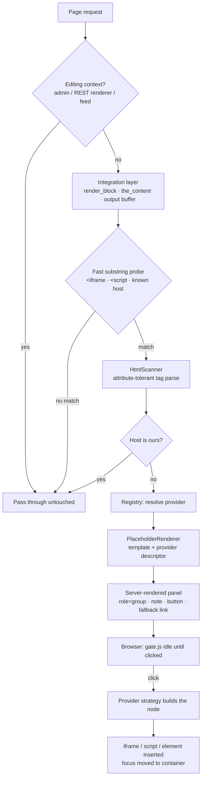

# Consent Gate — a two-click embed plugin for WordPress

**Implementation plan.** Written to be handed to Claude Code as the founding
document of a new repository. Everything here is either a decision, a
requirement, or a trap that has already been hit in production.

Provenance: this generalises a working implementation on a live WordPress site
(`calucon.de`), where the pattern currently gates 40 embeds across 22 pages with
zero third-party requests before interaction. The measurements quoted throughout
are real, taken from that site, not illustrative.

---

## 0. The problem, and the shape of the answer

### 0.1 What breaks today

A WordPress editor pastes a YouTube URL. WordPress turns it into an oEmbed
`<iframe>`. On every page view from that moment, before the visitor has been
offered any choice at all, the browser contacts Google.

Measured on `www.youtube.com/embed/<id>`, plain GET, **no playback, no scripts
run**:

| Cookie | Lifetime |
|---|---|
| `VISITOR_INFO1_LIVE` | ~18 months |
| `__Secure-ROLLOUT_TOKEN` | ~18 months |
| `YSC` | session |
| `__Secure-YNID` | session |
| `__Secure-YEC` | (cleared) |

Five cookies. Two of them long-lived identifiers. The same request on
`www.youtube-nocookie.com/embed/<id>` sets **zero**.

That is storage on the visitor's terminal equipment. Under **§ 25(1) TDDDG**
(Germany's implementation of ePrivacy Art. 5(3)) it requires prior informed
consent unless strictly necessary for a service the visitor explicitly
requested. A video the visitor has not asked to watch does not meet that bar.

The same is true of Vimeo, Google Maps, Spotify, SoundCloud, Instagram,
X/Twitter, TikTok, Facebook, Google Fonts, Gravatar, and — measured on the same
site — a plain WordPress-to-WordPress oEmbed preview, which set a
`pll_language` cookie with a **one-year** lifetime.

### 0.2 Why the usual answer is the wrong one

The reflex is a cookie banner. A banner is the expensive answer to this problem:
it needs a consent management platform, it needs a consent record, it degrades
Core Web Vitals, it annoys every visitor on every page, and it is the part of
privacy law most often implemented in a way that is itself unlawful.

The **two-click solution** (*Zwei-Klick-Lösung*, originally from heise.de in
2011) removes the obligation instead of managing it. If nothing third-party
loads until the visitor asks for it, there is nothing to consent to on page
load, so there is no banner to show. The consent is the click, scoped to the
one embed it was given for.

### 0.3 The market gap

Free options are thin. The capable ones (Borlabs Cookie, Real Cookie Banner,
Complianz premium) are subscriptions, and they solve this as a sub-feature of a
full CMP — so you buy and load an entire consent platform to avoid loading
YouTube. The free ones tend to be single-provider, or abandoned, or they gate
by rewriting `the_content` with a regex that assumes pretty-printed HTML and
silently fails on any site with HTML minification enabled.

There is room for a focused, free, GPL plugin that does exactly one thing
correctly and is honest about its boundaries.

### 0.4 Scope

**In scope.** Holding back third-party embeds until an explicit per-embed
action; a placeholder that is accessible, themeable and translatable; a
provider registry covering the common embeds with a documented extension API;
optional local thumbnails; optional consent memory; interoperation with an
existing CMP when one is present.

**Explicitly out of scope.** Being a consent management platform. Producing a
consent record for accountability purposes. Scanning a site for trackers.
Blocking analytics scripts the site owner installed deliberately. Advising on
compliance. If someone needs a documented Art. 7(1) consent record, they need a
CMP, and the plugin's README must say so.

---

## 1. Non-negotiable invariants

These are the rules that make the plugin worth installing. Every one of them
has a failure mode that is silent — the plugin appears to work while not
working. They belong in `CLAUDE.md` verbatim, and every PR should be checked
against them.

1. **Nothing third-party is contacted before the click.** Not a script, not an
   iframe, not a font, not a thumbnail, not a `preconnect`. This is the entire
   product. A feature that violates it is not a feature.
2. **The placeholder is rendered server-side.** A visitor with JavaScript
   disabled must still get a real, working link to the content — never a button
   that does nothing.
3. **Nothing is stored before consent.** Including by the plugin itself.
   `localStorage` is terminal-equipment storage; writing a "we showed the
   placeholder" flag would recreate the problem the plugin exists to remove.
4. **Never gate in an editing context.** The block editor, the REST block
   renderer, and the customizer must see the original markup. Gating there
   breaks editing and looks like data loss.
5. **The parser must tolerate minified HTML.** Attribute quotes stripped,
   newlines inside tags, attributes in any order. See §3.2 — this is the single
   most common reason competing implementations fail in the field.
6. **Gate on host, not on a provider allowlist.** An unknown third-party iframe
   is gated by default. The failure mode must be "gated something harmless"
   (visible, reportable) and never "let a new tracker through" (invisible).
7. **Never widen the privilege of what you rebuild.** If the original iframe
   carried `sandbox`, the replacement carries the same `sandbox`. Copy
   attributes from a safelist, never a loop over everything.
8. **No autoplay on activation.** The button says "Load". Audio starting
   unbidden is a WCAG 1.4.2 failure and is not what was asked for.
9. **The plugin never phones home.** No telemetry, no version check against a
   private endpoint, no remote font, no CDN asset. A privacy plugin that makes
   outbound requests is a contradiction, and WordPress.org will reject it.
10. **Never claim compliance.** The plugin is a technical measure. It cannot
    know the site's processing purposes. See §14.

---

## 2. Architecture

### 2.1 Request flow



### 2.2 Module map

```
calucon-embed-gate/
├── calucon-embed-gate.php                 Plugin header + bootstrap only
├── uninstall.php
├── src/
│   ├── Plugin.php                   Wiring; no logic
│   ├── Detection/
│   │   ├── HtmlScanner.php          Attribute-tolerant tag reader  (§3.2)
│   │   ├── HostMatcher.php          "is this ours?"                (§3.4)
│   │   ├── IframeRule.php
│   │   ├── ScriptRule.php
│   │   └── AssetRule.php            link/style/img/font            (§3.5)
│   ├── Providers/
│   │   ├── Registry.php
│   │   ├── Provider.php             Descriptor value object        (§4.1)
│   │   └── Builtin/                 YouTube, Vimeo, Maps, …        (§4.2)
│   ├── Rendering/
│   │   ├── PlaceholderRenderer.php
│   │   ├── TemplateLoader.php       Theme override                 (§7.4)
│   │   ├── AspectRatio.php          Layout preservation            (§5.3)
│   │   └── Thumbnail/               [REJECTED — never build: §5.4 auto-fetch is an outbound request]
│   ├── Integration/
│   │   ├── RenderBlock.php
│   │   ├── TheContent.php
│   │   ├── OutputBuffer.php         Page builders                  (§3.3)
│   │   ├── Oembed.php
│   │   └── Cmp/                     Complianz, Borlabs, …          (§6.4)
│   ├── Admin/
│   │   ├── SettingsPage.php
│   │   └── BlockEditor.php          Per-block override control     (§7.5)
│   └── Support/
│       ├── Options.php              Typed, defaulted, sanitised
│       └── Html.php
├── assets/{js,css}/
├── templates/placeholder.php        Overridable                    (§7.4)
├── tests/{Unit,Integration,E2E,Fixtures}/
├── CLAUDE.md                                                       (§12)
├── readme.txt                       WordPress.org
└── README.md
```

**Design rule:** `src/` has no WordPress globals outside `Integration/` and
`Admin/`. `Detection/`, `Providers/` and `Rendering/` take plain strings and
arrays and return plain strings and arrays. That is what makes §10.1 possible —
fixture tests that run in milliseconds without booting WordPress.

---

## 3. Detection

The hardest part of the plugin, and the part where the competition fails.

### 3.1 Why not DOMDocument

Tempting, and wrong for the default path:

- `DOMDocument` on an HTML fragment mangles it — it injects `<html><body>`,
  moves misplaced nodes, and mutilates HTML5 the PHP libxml build does not know.
- Round-tripping through `saveHTML()` reformats markup the site owner did not
  ask to have reformatted, and can break other plugins' regexes downstream.
- It is slow enough to matter when it runs on every block of every request.

Use a **targeted tag reader** — find candidate start tags, parse just their
attributes, replace just that span. Everything else in the content is passed
through byte-for-byte. `DOMDocument` is acceptable in admin-only tooling and
in tests, where correctness beats fidelity.

### 3.2 The minified-HTML problem

This is the invariant most likely to be broken by a well-meaning refactor.

Cache plugins (W3 Total Cache, Autoptimize, LiteSpeed, WP Rocket, Cloudflare
Auto Minify) rewrite the HTML *after* WordPress renders it, but a filter on
`the_content` may see already-minified content in other configurations, and the
markup a scanner meets in the field routinely looks like this:

```html
<div
class=wp-block-embed__wrapper> <iframe
loading=lazy title="Kolkja Cycling" width=422 height=750 src="https://www.youtube.com/embed/y_pjE_p1HwE?feature=oembed" frameborder=0></iframe> </div>
```

Note what is happening: **the quotes are gone from values that do not need
them**, and **there is a newline immediately after the tag name**. A pattern
like `/<iframe[^>]+src="([^"]+)"/` matches nothing here. It fails silently, the
embed loads, and the site owner believes they are protected.

This is not hypothetical. On the source site, the first audit pass used exactly
that shape of pattern and **missed seven iframes on five pages**, reporting "no
YouTube iframe was found on any crawled page" while four videos were loading
Google cookies on every view.

**Requirements for `HtmlScanner`:**

- Attribute values may be double-quoted, single-quoted, or bare.
- Any whitespace, including newlines, may appear between the tag name and
  attributes and between attributes.
- Attributes appear in any order; `src` is not first.
- Boolean attributes with no `=` are valid (`allowfullscreen`, `defer`).
- Attribute names are matched case-insensitively and normalised to lowercase.
- Entity-encoded values are decoded before URL parsing
  (`&amp;` in a query string is extremely common).
- The reader must handle both `<iframe …></iframe>` and a stray self-closed
  `<iframe … />`.
- It must **not** match inside `<script>`, `<style>`, `<textarea>`, `<pre>`
  containing escaped markup, or HTML comments.
- Escaped markup (`&lt;iframe`) must never match — a tutorial post showing an
  embed snippet must survive.

A reference attribute pattern that satisfies the quoting rules:

```php
'#([a-z_:][a-z0-9_.:-]*)(?:\s*=\s*(?:"([^"]*)"|\'([^\']*)\'|([^\s"\'>]+)))?#i'
```

Note the optional value group — that is what makes boolean attributes work.

### 3.3 Where to hook

No single hook is sufficient. Ship a matrix and let the site owner see which
integrations are active.

| Integration | Covers | Priority | Notes |
|---|---|---|---|
| `render_block` | Block themes, Gutenberg content | default 10 | Fires for nested blocks too — see §9.1 |
| `the_content` | Classic themes, older content | 20 | After `wpautop`, before shortcode-unwrapping plugins |
| `widget_block_content`, `widget_text` | Widgets | 10 | Legacy widget areas still exist everywhere |
| `embed_oembed_html` | oEmbed results | 10 | Catches the embed before it is cached in postmeta — see §9.9 |
| `get_the_excerpt` | Excerpts | 10 | Strip embeds entirely rather than gating |
| Output buffer on `template_redirect` | Page builders (Elementor, Divi, WPBakery, Bricks) | — | **Opt-in only.** See below |
| `script_loader_tag`, `style_loader_tag` | Enqueued third-party assets | 10 | Google Fonts, provider SDKs |
| `wp_resource_hints` | `dns-prefetch` / `preconnect` | 10 | See §9.14 |

**On the output buffer.** Page builders render outside the content filters, so
for a large minority of sites nothing else works. But an output buffer over the
whole document is invasive: it fights other buffering plugins, it can break
streaming, and a fatal inside the callback yields a blank page. Therefore:

- Off by default; a clearly-labelled setting with a warning.
- Registered late (`template_redirect`, low priority) and closed on `shutdown`.
- Wrapped so any exception returns the buffer unmodified.
- Skipped for non-HTML content types, feeds, REST, AJAX, sitemaps, and any
  response already committed.
- Must check `ob_get_level()` and never assume it owns the stack.

### 3.4 Determining "ours"

Naive `$host === parse_url(home_url(), PHP_URL_HOST)` is wrong on real sites.
`HostMatcher` must consider:

- `home_url()` **and** `site_url()` (WordPress-in-a-subdirectory installs).
- Multisite: every domain in the network, and mapped domains.
- A configurable **additional-own-hosts** list, which is how a site declares its
  own CDN (`cdn.example.com`), its own media subdomain, or a sibling property.
- `www.` / bare-domain equivalence, configurable, on by default.
- Protocol-relative URLs (`//example.com/…`) resolved against the current scheme.
- Relative URLs — same-origin by definition, never gated.
- `data:`, `blob:`, `about:blank`, `javascript:` — never gated, never rebuilt.
- IDN/punycode normalisation before comparison.
- Optional subdomain-wildcard entries (`*.example.com`).

### 3.5 What to detect beyond iframes

Ship as separate, individually-toggleable rules:

- **Iframes** — the default and the bulk of it.
- **Scripts** — provider SDKs that inject their own iframe later: Strava,
  X/Twitter (`platform.twitter.com`), Instagram, TikTok, Facebook, Reddit,
  Giphy, Typeform, Calendly. The script must be *removed*, not deferred;
  a `type="text/plain"` rewrite is the conventional trick and is preferable to
  deletion because it round-trips cleanly on activation.
- **Stylesheets and fonts** — `fonts.googleapis.com` and `fonts.gstatic.com`.
  In Germany this is the single most-litigated third-party request (the LG
  München I decision of 20 January 2022, and the mass-mailing wave that
  followed). Gating a font behind a click is poor UX, so the correct product
  behaviour here is different: **detect and warn in the admin, and offer a
  "localise" action**, not a placeholder.
- **Images** — Gravatar, `i.ytimg.com`, remote hotlinked images. Gate or
  proxy-cache locally; make it opt-in because it can break layouts.
- **Resource hints** — see §9.14.

---

## 4. Providers

### 4.1 Descriptor

A provider is data, not a class hierarchy. Registration should be a filter
returning an array, so a site can add one from `functions.php` in ten lines.

```php
[
    'id'            => 'youtube',
    'label'         => __( 'YouTube', 'calucon-embed-gate' ),
    'match'         => [
        'iframe_host' => [ 'youtube.com', 'www.youtube.com',
                           'youtube-nocookie.com', 'www.youtube-nocookie.com',
                           'youtu.be' ],
        'iframe_path' => '#^/embed/(?P<id>[A-Za-z0-9_-]{6,20})#',
    ],
    // Where the embed is loaded from AFTER consent. Data minimisation:
    // measured 0 cookies vs 5 on the default host.
    'load_host'     => 'www.youtube-nocookie.com',
    'load_path'     => '/embed/{id}',
    // Where a human goes instead. Must be a real page, not an embed endpoint.
    'fallback'      => 'https://www.youtube.com/watch?v={id}',
    'privacy_url'   => 'https://policies.google.com/privacy',
    'controller'    => 'Google Ireland Limited, Dublin, Ireland',
    'note'          => __( 'Loading this video contacts YouTube (Google), which receives your IP address and which page you are on, and sets cookies.', 'calucon-embed-gate' ),
    'action'        => __( 'Load video from YouTube', 'calucon-embed-gate' ),
    'thumbnail'     => 'https://i.ytimg.com/vi/{id}/maxresdefault.jpg',
    'aspect'        => '16:9',
    'iframe_allow'  => 'accelerometer; encrypted-media; gyroscope; picture-in-picture; web-share',
    'strategy'      => 'iframe',   // iframe | script | element | callback
]
```

`{id}` and any other named capture from `iframe_path` interpolate into
`load_path`, `fallback` and `thumbnail`. Every interpolation is URL-encoded at
substitution time, never at template-authoring time.

**Owner-defined providers (settings, 0.10.0).** The Providers tab stores
`custom_providers[]` rows — `id` (`custom-<slug>`, generated once from the
label and kept so the per-provider override row stays attached), `label`,
`hosts`, `script_hosts`, `kind`. `Providers\CustomProviders::descriptors()`
turns them into descriptors with the generic note/action wording and no
load-target rewrite. **A custom row can never weaken the gate:** hosts a
built-in handles are refused at save time (`Options::sanitize_report()`
with the reserved set, surfaced as a settings notice) and stripped again at
run time (`CustomProviders::descriptors()` receives `reserved_hosts()`),
built-ins are listed first, and `apply_provider_overrides()` ignores
`enabled` for custom ids — they are always gated; exemptions belong to the
never-gate list. Rows ≤ 100, hosts ≤ 50 per list. Pinned by
`CustomProvidersTest`: the fixture corpus is byte-identical with unrelated
rows and with rows claiming every built-in host; hostile rows written
straight into the option neither throw nor widen privilege. Override rows
for removed custom ids are pruned on save.

### 4.2 Built-in set

Ship enough that a typical site needs no configuration.

| Provider | Detect | Privacy-preserving load target | Notes |
|---|---|---|---|
| YouTube | iframe | `youtube-nocookie.com` | Measured 5 → 0 cookies |
| Vimeo | iframe | `player.vimeo.com` + `dnt=1` | `dnt=1` suppresses their analytics |
| Google Maps | iframe | — | No private variant; gate only |
| OpenStreetMap | iframe | — | Offer as the suggested replacement for Maps |
| Spotify | iframe | — | |
| SoundCloud | iframe | — | |
| Apple Music / Podcasts | iframe | — | |
| Strava | **script** | — | Re-scan hook required, see §9.6 |
| X / Twitter | script | — | `platform.twitter.com/widgets.js` |
| Instagram | script | — | |
| TikTok | script | — | |
| Facebook | script/iframe | — | |
| Google Calendar | iframe | — | |
| Google Forms | iframe | — | |
| Typeform, Calendly | script/iframe | — | |
| Matterport, Sketchfab | iframe | — | |
| WordPress oEmbed | iframe | — | The `wp-embedded-content` pair, §9.7 |
| **Generic fallback** | iframe | — | Any unknown cross-origin iframe |

The generic fallback is what makes invariant 6 real. Its label is the host name;
its fallback URL is derived by stripping a trailing `/embed/` (and preferring
the canonical link from a WordPress fallback blockquote when one is present).

---

## 5. Rendering

### 5.1 Markup contract

Other code — themes, tests, CMP bridges — depends on this shape. Treat it as
public API and version it.

```html
<div class="cg-embed"
     role="group"
     aria-label="{accessible name}"
     data-cg-provider="youtube"
     data-cg-payload="{json}">
  <div class="cg-embed__panel">
    <p class="cg-embed__note">{note}</p>
    <button type="button" class="cg-embed__button">{action}</button>
    <p class="cg-embed__fallback"><a href="{fallback}" rel="noopener nofollow">{fallback label}</a></p>
    <p class="cg-embed__privacy"><a href="{privacy_url}" rel="noopener nofollow">{provider} privacy policy</a></p>
  </div>
</div>
```

`cg-embed__privacy` (0.10.0) is present only for providers that declare a
`privacy_url` and only while `display.privacy_link` is on (off by default); the template exposes
it as `$privacy_url` / `$privacy_label`. Scripts must find the fallback
link **by its class**, never as "the last link in the panel" — the privacy
link now follows it (gate.js `removePanel` was fixed for exactly this).

**`role="group"` with `aria-label`, not a heading.** This was learned the hard
way: the original implementation opened the panel with a bold paragraph, which
an external accessibility scanner correctly flagged as a heading in everything
but markup (WCAG 1.3.1). Promoting it to a real `<h3>` is also wrong, because
the correct level depends on where the embed sits — measured on one site, panels
followed an `h1` on single posts and an `h2` on archives, so any fixed level
skips somewhere. `group` is not a landmark, so it names the region without
adding noise to the landmark list or the document outline.

### 5.2 Payload

`data-cg-payload` carries the JSON the front-end needs to build the real node.
Rules:

- Only what is needed. Never the full original tag.
- Attribute safelist on rebuild: `title`, `width`, `height`, `sandbox`,
  `loading`, `allow`, `allowfullscreen`, `referrerpolicy`. Never `style`, never
  `srcdoc`, never `on*`.
- `style` is excluded deliberately: WordPress ships its cross-site embeds as
  `style="position:absolute;visibility:hidden"` and reveals them from
  `wp-embed.js` after a `postMessage` handshake. Carrying that over means the
  visitor opts in and watches nothing appear.

### 5.3 Aspect-ratio preservation

A gated embed must occupy the space the real one would, or the page reflows on
activation and the placeholder renders in the wrong place before it.

The specific trap, in core block themes: `wp-block-embed` with
`wp-has-aspect-ratio` reserves height with an empty `::before` spacer carrying a
percentage `padding-top`, and lifts the iframe **out of flow** on top of it.
Substitute a placeholder that stays in flow and it renders *underneath* a large
empty rectangle — a full-width gap with the button below it, on every video.

Requirements:

- Detect the wrapper's reserved box and position the panel into it
  (`position:absolute; inset:0`), scoped so it only applies where a box was
  actually reserved.
- The panel's contents scroll rather than spill: a 16:9 box at a 320px viewport
  is only 180px high, which a note plus a button can exceed.
- Where no aspect box exists, use the provider's declared `aspect` with the
  modern `aspect-ratio` property, falling back to the embed's `width`/`height`.
- Verify by measurement, not by eye: assert the panel's bounding box equals the
  wrapper's. On the source site this reads 645×1147 in 645×1147 for a 9:16
  short and 645×363 in 645×363 for a 16:9 video.

### 5.4 Thumbnails (optional feature, own risk surface)

A poster frame makes the placeholder look like a video rather than a notice —
but naively it means fetching from `i.ytimg.com`, which is the exact request the
plugin exists to prevent.

Therefore: **fetch server-side, store locally, serve from the site's own
origin.** Design notes:

- Fetch at save time (`save_post`, or a scheduled backfill), never during a
  visitor's request.
- Store as a real attachment or in `uploads/calucon-embed-gate/` with a content hash
  filename; regenerate on demand via WP-Cron.
- Honour `WP_Filesystem`; handle read-only filesystems by degrading to no
  thumbnail rather than fataling.
- Failure is non-fatal and cached negatively, so a dead video does not retry on
  every save.
- Respect the site's image sizes and generate WebP where available.
- Licensing caveat in the docs: caching a provider's thumbnail may exceed what
  their terms permit. Ship the feature **off by default** with that note.
- Provide a "purge cached thumbnails" action, and clean up on uninstall.

---

## 6. Consent model

### 6.1 Default: no memory

Out of the box, consent applies to the one embed clicked, is not stored
anywhere, and is gone on the next page load. This is the safest default and the
cheapest to reason about: nothing is written to the device, ever, so the plugin
itself never becomes the thing that needs consent.

### 6.2 Optional memory, and why it is defensible

Site owners will ask for "don't ask me again". Offer it, off by default, with
three scopes: **this embed**, **this provider**, **all providers**; and two
lifetimes: **session** (`sessionStorage`) and **persistent** (`localStorage`,
configurable duration).

The legal reasoning to put in the docs — a storage entry whose sole purpose is
to record the user's own choice is conventionally treated as strictly necessary
for a service the user explicitly requested, which is the same exemption a
consent banner relies on to remember that you dismissed it. The plugin must
nonetheless:

- Store no identifier, only a scope key and a timestamp.
- Never write anything until after the first click.
- Provide a visible, keyboard-reachable **withdraw** control when memory is on,
  because storing consent creates an Art. 7(3) withdrawal obligation that the
  stateless default does not.
- Expose withdrawal as a shortcode/block so it can be placed in the privacy
  policy.

### 6.3 Caching interaction

Consent state must remain **client-side only**. A server-side per-visitor
consent state would make every page uncacheable, which on a typical shared-host
WordPress site is a worse outcome than the feature is worth. This constraint is
why §6.2 is `localStorage` and not a cookie read in PHP.

### 6.4 CMP interoperation

When a real CMP is installed, the plugin must not fight it. Detect and defer:

- **Complianz**, **Borlabs Cookie**, **Real Cookie Banner**, **CookieYes**,
  **Cookiebot**, **Usercentrics**.
- Two modes: *bridge* (a CMP grant for the matching purpose auto-activates
  gated embeds) and *stand aside* (the plugin stops gating providers the CMP
  already handles, to avoid a double prompt).
- Also support the IAB TCF `__tcfapi` and Google Consent Mode v2 signals behind
  a feature flag, as a generic bridge.
- Always: if the bridge cannot be established, fail **closed** — stay gated.

---

## 7. Customisation surface

"Generic for every WordPress site" means the defaults are opinionated and
everything is overridable. Four layers, in increasing order of power.

### 7.1 Settings UI

Information architecture:

- **Providers** — table of built-ins plus the owner's own providers (§4.1);
  per-provider on/off (built-ins only), custom note/action text,
  privacy-variant on/off, privacy-policy URL override; the panel
  privacy-link toggle.
- **Detection** — which rules are active; the additional-own-hosts list; the
  never-gate host list; the always-gate host list; output-buffer toggle with
  its warning.
- **Appearance** — quick styles, then sectioned controls (colours following
  the theme palette by name or overridden; shape/layout; button; poster
  image placement; withdraw button; dark mode) with a live preview and an
  automatic readability (contrast) check. No thumbnail auto-fetch — posters
  are owner-supplied per block (§5.4 rejected).
- **Consent** — memory scope and lifetime; withdrawal control placement.
- **Compatibility** — detected CMP, detected cache plugin, detected page
  builder, and what the plugin decided to do about each. This screen is the
  support-load reducer; make it good.
- **Status** — a scan of the current site's content reporting which third-party
  hosts appear and whether each is currently gated. Read-only, no outbound
  requests.

Settings are stored as a **single option array**, typed and sanitised through
`Support/Options.php`, with a schema and defaults in one place.

### 7.2 Filters and actions

Publish these as documented API from 1.0 and treat them as semver-bound.

```php
// Providers
apply_filters( 'calucon_embed_gate_providers', array $providers );
apply_filters( 'calucon_embed_gate_provider_for_url', ?array $provider, string $url );

// Decisions
apply_filters( 'calucon_embed_gate_should_gate', bool $gate, string $url, array $ctx );
apply_filters( 'calucon_embed_gate_is_own_host', bool $own, string $host );

// Rendering
apply_filters( 'calucon_embed_gate_placeholder_html', string $html, array $provider, array $ctx );
apply_filters( 'calucon_embed_gate_note_text',   string $note,   array $provider, array $ctx );
apply_filters( 'calucon_embed_gate_action_text', string $action, array $provider, array $ctx );
apply_filters( 'calucon_embed_gate_fallback_url', string $url,   array $provider, array $ctx );
apply_filters( 'calucon_embed_gate_payload',      array  $payload, array $provider );

// Lifecycle
do_action( 'calucon_embed_gate_embed_gated',   array $provider, array $ctx );
do_action( 'calucon_embed_gate_before_render', array $provider );
```

`$ctx` carries post ID, block name, and the integration that matched — enough
for a site to make per-page decisions without re-parsing.

### 7.3 CSS custom properties

Every colour, radius, spacing and font in the panel resolves from a custom
property with a sensible fallback, so a theme restyles it without a stylesheet
override war:

```css
.cg-embed {
  --cg-bg:        var(--wp--preset--color--base, #1b1b1b);
  --cg-fg:        var(--wp--preset--color--contrast, #f0f0f0);
  --cg-accent:    var(--wp--preset--color--accent-8, #5c9e00);
  --cg-accent-fg: #1b1b1b; /* button text; pairs with --cg-accent, never with --cg-bg */
  --cg-radius:    4px;
  --cg-gap:       0.75rem;
  --cg-font:      inherit;
}
```

**Do not forget `font-family: inherit` on the `<button>`.** A `<button>` does
not inherit typography — the UA stylesheet substitutes the system UI font. On
the source site this shipped once and the control rendered in Arial 400 beside a
page set in Fira Code 300. It looked like a third-party widget bolted on, and no
automated check in the entire audit caught it. Set `font-family`, `font-weight`
and `letter-spacing` to `inherit` explicitly.

Also explicit: the panel paints its own background, so link colour inside it
cannot be inherited from the page. Left to the browser default, a fallback link
renders `#0000EE` on a dark panel — measured 1.3:1, a WCAG 1.4.3 failure.

### 7.4 Template overriding

Standard WordPress convention: the plugin looks for
`{theme}/calucon-embed-gate/placeholder.php` before its own
`templates/placeholder.php`, via `locate_template()`. Pass the provider
descriptor and context as explicit variables, document them at the top of the
shipped template, and keep the markup contract in §5.1 as the documented
minimum a custom template must satisfy.

### 7.5 Block editor integration

- A sidebar panel on any block containing an embed: **Gate this embed**
  (default / always / never), stored in block attributes so it travels with the
  content.
- A visible badge in the editor canvas indicating a block will be gated, so the
  editor is never surprised by the front end.
- No gating of the actual preview.

---

## 8. Accessibility contract

The placeholder is an interactive control that replaces content. It is easy to
make it worse than what it replaced. These are requirements, with the criterion
each one answers.

| Requirement | Criterion |
|---|---|
| Panel named via `role="group"` + `aria-label`; **no fake heading** | 1.3.1 A |
| Real `<button type="button">`, not a div with a click handler | 2.1.1 A, 4.1.2 A |
| Visible focus indicator meeting 3:1 against the panel's own background | 2.4.7 AA, 1.4.11 AA |
| Button hit area ≥ 24×24 CSS px | 2.5.8 AA |
| Text and link contrast ≥ 4.5:1 **against the panel background**, computed, not assumed | 1.4.3 AA |
| Link affordance not carried by colour alone | 1.4.1 A |
| Focus moved to the container after activation, never lost to `<body>` | 2.4.3 A |
| No autoplay; no `autoplay` in the iframe `allow` list | 1.4.2 A |
| Panel contents scroll rather than clip when the reserved box is short | 1.4.10 AA |
| Placeholder text zoomable to 200% without loss | 1.4.4 AA |
| `prefers-reduced-motion` respected in any transition | 2.3.3 AAA |
| Fallback link works with JavaScript off | — (invariant 2) |
| Loading state announced (`aria-live="polite"`) for slow providers | 4.1.3 AA |
| Error state announced via `role="alert"` with a route to the fallback | 3.3.1 A |
| RTL layout correct (`padding-inline`, `margin-inline`, no `left`/`right`) | 1.3.2 A |

**The focus trap that is easy to miss:** when a provider script replaces the
node you inserted, the element that had focus is removed from the document and
focus silently falls back to `<body>` — the keyboard user is thrown to the top
of the page by their own click. Set `tabindex="-1"` on the *container* (which
survives the swap) and focus that.

---

## 9. Edge cases

Ordered roughly by likelihood of biting.

### 9.1 Nested block rendering

`render_block` fires for inner blocks *and* for the parent, whose content
already contains the rendered children. Without care, a placeholder gets
re-processed and double-wrapped. Mitigations: the fast substring probe naturally
skips already-gated content (no `<iframe>` remains); additionally, bail if the
content already contains `data-cg-provider`, and never emit a raw `<iframe`
substring inside the payload JSON.

### 9.2 Editing contexts

Bail on all of: `is_admin()`, `wp_doing_ajax()`, `REST_REQUEST` where the route
is the block renderer, `is_customize_preview()`, `wp_is_json_request()` for
editor endpoints, and any request where `$_GET['context'] === 'edit'`. Gating a
block in the editor looks like the plugin ate the content.

### 9.3 Feeds, exports, and non-HTML output

`is_feed()` — strip the embed and emit the fallback link instead; a placeholder
in RSS is nonsense. Also skip: `is_embed()` (the site's own oEmbed output),
sitemaps, `wp_is_rest_request()` for content APIs, AMP output (if the AMP plugin
is active, defer to its own consent component), and any export or print
stylesheet path.

### 9.4 Escaped and quoted markup

A post that *documents* an embed contains `&lt;iframe …&gt;`. It must survive
untouched. Similarly, markup inside `<code>`, `<pre>`, `<script type="text/template">`,
`<template>` and HTML comments must not be rewritten.

Exclusion ranges must be computed in one sequential pass, the way a browser
tokenises — never as independent global regexes. Two independent passes
cross-contaminate: a literal `<!--` inside a script body (JSON-LD, legacy
script-hiding) opens a bogus comment range to end-of-input and every embed
after it goes ungated, silently. Unterminated containers follow browser
behaviour: an unterminated comment or raw-text element (`script`, `style`,
`textarea`, `title`, `template`) swallows the rest of the document — nothing
in it can fire, so excluding to end-of-input is accurate. An unterminated
`<pre>`/`<code>` is different: browsers keep parsing markup inside it, an
iframe there still fires, so it excludes nothing — fail closed and gate.

### 9.5 Iframes with no usable `src`

`about:blank`, `data:`, relative paths, and empty `src` pass through
unmodified. Never emit a placeholder whose fallback link points nowhere —
that is a 2.4.4 failure and worse than the original.

Two refinements learned since the first draft:

- **`srcdoc` is not automatically inert.** A srcdoc iframe executes its inline
  document, including third-party `<script src>` and `` — the widely
  copied "srcdoc lazy YouTube" snippet requests the thumbnail at page load.
  When the srcdoc references a foreign host, gate it: the payload carries the
  original srcdoc verbatim (equal privilege, invariant 7) and the fallback
  link is harvested from the first foreign `<a href>` inside it. A srcdoc
  that references nothing foreign still passes through.
- **A lazy-load `data-src`/`data-lazy-src`/`data-original` attribute is a
  usable src.** Lazy-load plugins park the real URL there and shim `src` with
  `about:blank` or a `data:` GIF; the parked URL is the one that fires on
  scroll. Treat it exactly like `src` (see §9.8).

An invisible foreign iframe — zero-sized, `hidden`, or `display:none` (GTM's
noscript pixel) — is a tracker, not content: it is removed outright rather
than gated, because a visible "Load content from googletagmanager.com" panel
for no-JS visitors is a regression, and there is no content to link to.
`visibility:hidden` alone does NOT count as invisible: core's own
WordPress-to-WordPress embed iframe ships that way until wp-embed.js reveals
it.

### 9.6 Provider scripts that render many embeds

Strava's `embed.js` assigns `window.__STRAVA_EMBED_BOOTSTRAP__` and calls it
once on load; it re-scans the document each time it runs. Load it for the first
opt-in and it renders **only** the placeholder present at that moment. Every
later click on the same page does nothing unless the bootstrap is invoked again.

General requirement: a script-strategy provider declares an optional `ready`
callback invoked after load and after each subsequent activation. Track script
load state per provider in a promise map so the script is fetched once.

### 9.7 The WordPress-to-WordPress embed pair

Core emits a `<blockquote class="wp-embedded-content">` (the no-JS fallback)
immediately followed by the `<iframe>`, linked by `data-secret`. Gate the iframe
alone and the blockquote remains visible, duplicating the panel. Consume both,
and harvest the blockquote's `<a href>` as the fallback URL — it is the
canonical page, which is a better destination than a derived `/embed/` URL.

### 9.8 Lazy loading and `loading="eager"`

`loading="lazy"` is not consent — it defers the request to scroll time, which is
still without consent. Do not treat a lazy iframe as lower priority. Worth
noting in the admin scan: on the source site, three of four YouTube embeds had
**no** `loading` attribute at all and fired on page load.

The same reasoning covers attribute-swapped lazy loading (WP Rocket,
LiteSpeed, Perfmatters, lazysizes markup saved into content): the real URL
sits in `data-src`/`data-lazy-src`/`data-original` while `src` is a shim.
The scanner treats those attributes as the effective src — an iframe whose
only foreign URL is parked in a data attribute is still gated.

### 9.9 oEmbed caching in postmeta

WordPress caches oEmbed HTML in `_oembed_{hash}` postmeta. If gating happens at
`embed_oembed_html`, the *gated* markup may be what gets cached — which is fine
until the plugin is deactivated, leaving placeholders baked into content with no
JavaScript to activate them. Prefer gating at render time, not at cache time;
if hooking `embed_oembed_html`, ensure deactivation triggers an oEmbed cache
flush, and make `uninstall.php` do the same.

### 9.10 Deactivation and uninstall

Deactivating must restore original behaviour immediately and completely. Since
gating happens at render, that is automatic — which is an argument for render-time
gating over content rewriting. **Never rewrite post content in the database.**
Uninstall removes options, transients, cached thumbnails, and flushes oEmbed
caches.

### 9.11 Multisite

Network-activated with per-site settings; a network-admin defaults screen;
`HostMatcher` aware of every site in the network so a cross-site embed inside
one network is not gated as third-party.

### 9.12 Caching plugin interaction

The placeholder is static and fully cacheable — that is a design win worth
stating. But: after activating or reconfiguring the plugin, every cached page
still serves the old markup. The plugin should **flush known cache plugins on
settings save** (W3TC, WP Rocket, LiteSpeed, WP Super Cache, Autoptimize,
SG Optimizer, Cloudflare via the official plugin) and, where it cannot, say so
prominently.

There is a nastier variant worth documenting in the README because it will
generate support tickets that look like plugin bugs: some minification setups
serve CSS from a content-addressed-looking URL that is **not** actually derived
from file contents, with a one-year `max-age`. Measured on the source site: the
bundle name stayed identical across a deploy that changed its bytes, so browsers
that had loaded it kept the old CSS for a year and no server-side purge could
reach them. If the panel looks unstyled after an update, that is the cause, and
the fix is a hard reload — not a plugin change.

### 9.13 Content Security Policy

Sites with a CSP need `frame-src` entries for each provider's load host. Provide
a **generated CSP snippet** in the admin based on which providers are enabled —
and note that the whole point is those hosts are *not* contacted until consent,
so the CSP entry is permission, not traffic.

The admin section is collapsed and leads with "do I need this?" — most sites
send no policy. It offers a browser-side self-check: the owner's browser
fetches the site's own home page (same-origin, on click), reads the
`Content-Security-Policy` header or `<meta http-equiv>`, and reports whether
the enabled providers' hosts are already permitted, honouring the CSP3
fallback chain (`frame-src` → `child-src` → `default-src`). The server makes
no request (invariant 9). Report-only policies are reported as
informational, never as blocking.

### 9.14 Resource hints

`dns-prefetch` and `preconnect` to a provider undermine the gate to different
degrees, and the distinction matters:

- **`preconnect` opens a TCP+TLS connection** to the provider on page load. That
  contacts them and reveals the visitor's IP. It must be stripped.
- **`dns-prefetch` performs name resolution only**, through the visitor's own
  resolver. It opens no connection and sends no IP to the provider, so it is
  neither a § 25 nor an Art. 6 issue — but it is pointless once gated and should
  be removed for tidiness.

Filter `wp_resource_hints`, and additionally scrub hint tags injected by
performance plugins (Optimization Detective, Perfmatters) which do not go
through that filter.

### 9.15 Translation and dynamic strings

The note text names the provider, so it must be built with `sprintf` and a
`translators:` comment, never concatenated. Ship a `.pot`; support
`load_plugin_textdomain`; remember WordPress 6.5+ prefers PHP translation files.
Provider names are proper nouns and are **not** translated.

### 9.16 Performance

`render_block` runs on every block of every page. Order the work: cheap
`stripos` probe → early return; only then the regex; only then URL parsing.
Cache the compiled provider match table in a static, rebuilt on the providers
filter. Target: no measurable TTFB change on a page with no embeds.

### 9.17 Ordering against other plugins

Another plugin may also filter `the_content` and may run before or after. Pick
explicit priorities, document them, and make them filterable. Known conflicts to
test: Jetpack (its own lazy-loading and Instagram/Twitter handling), AMP,
Elementor, and any CMP from §6.4.

---

## 10. Testing

The plugin's correctness claim is "no third-party request happens". That claim
is only credible if it is asserted mechanically.

### 10.1 Fixture tests (fast, no WordPress)

Because `Detection/` and `Rendering/` are WordPress-free, the core can be tested
with plain PHPUnit over a fixture corpus. **Build this corpus first** — it is
the highest-value asset in the repository.

Each fixture is an input HTML file plus expected output. Corpus must include, at
minimum:

- Every built-in provider, as WordPress authors it.
- **The same markup after W3TC/Autoptimize minification** — quotes stripped,
  newlines in tags. Non-negotiable; see §3.2.
- Single-quoted attribute variants.
- Attribute-order permutations, `src` last.
- Boolean attributes without values.
- The WordPress `blockquote` + `iframe` pair.
- A same-origin iframe → must pass through byte-identical.
- An iframe with no `src` → passes through.
- Escaped `&lt;iframe&gt;` in post content → passes through.
- An iframe inside `<pre>`, inside a comment, inside `<script>`.
- Already-gated content re-fed through the filter → idempotent.
- Protocol-relative and relative `src`.
- An iframe with `sandbox` → sandbox preserved exactly.
- Entity-encoded query strings.

Assert byte-identity on every pass-through case. That is what catches a regex
that "works" but reformats.

### 10.2 Integration tests (WordPress test suite)

Hook behaviour, options round-tripping, multisite host matching, editor-context
bail-outs, feed bail-outs, uninstall cleanup.

### 10.3 End-to-end (Playwright)

The tests that verify the actual product claim:

1. Load a page with each provider. **Assert zero network requests to any
   third-party host.** This is the headline test; it should fail loudly.
2. Assert the panel's bounding box equals the reserved aspect box.
3. Click. Assert the correct node is inserted, pointing at the
   privacy-preserving host where one exists.
4. Assert focus is on the container, not `<body>`.
5. Assert the button's hit area ≥ 24×24.
6. With JavaScript disabled, assert the fallback link is present and correct.
7. With memory enabled, assert nothing is written to storage before the click
   and the right key after it.

### 10.4 Accessibility

`axe-core` on a page per provider, at 360px and 1280px, in both colour schemes,
failing the build on any violation. Plus a manual screen-reader pass
(NVDA/Firefox, VoiceOver/Safari) before each minor release — automation does not
catch a wrong-sounding accessible name.

### 10.5 Compatibility matrix

CI cannot cover all of this; keep a documented manual matrix and work through it
before releases.

| Axis | Values |
|---|---|
| WordPress | current, current − 1, minimum supported |
| PHP | 7.4 → 8.4 |
| Themes | Twenty Twenty-Four/Five (block), Astra, GeneratePress, Kadence, one classic |
| Builders | Elementor, Divi, Bricks, WPBakery |
| Cache | W3TC, WP Rocket, LiteSpeed, WP Super Cache, Cloudflare Auto Minify |
| CMP | Complianz, Borlabs, Real Cookie Banner, none |

---

## 11. Repository and tooling

- **PHP 7.4 minimum** — matches WordPress's own floor and still reaches most
  installs. Typed properties, arrow functions, null coalescing assignment.
  No PHP 8-only syntax until the floor moves.
- **Composer** for dev dependencies only. Ship no `vendor/` unless a runtime
  dependency becomes unavoidable; if it does, scope it with PHP-Scoper.
- **`wp-scripts`** for editor assets. Front-end `gate.js` stays **dependency-free
  vanilla ES5-compatible** — it must run before any framework and on old
  browsers, and it is small enough that a build step is not worth it.
- **PHPCS** with `WordPress-Extra` + `WordPress-Docs`, and **PHPStan** at level
  6+.
- **GitHub Actions**: lint → unit → integration matrix → E2E → axe. Block merge
  on any failure.
- **Semver**, with the §5.1 markup contract and §7.2 filters as the public
  surface.
- Branch naming, commit style, and PR template that requires an explicit
  "invariants checked" box referencing §1.

---

## 12. `CLAUDE.md` specification

The repository must carry a `CLAUDE.md` that makes an agent productive without
re-deriving this document. Required sections:

1. **What this plugin is, in three sentences** — including the sentence "the
   entire product is that nothing third-party loads before a click".
2. **The invariants from §1, verbatim, as a checklist.** Framed as "if a change
   would break one of these, stop and ask."
3. **Architecture map** — the module table from §2.2, with the rule that
   `Detection/`, `Providers/` and `Rendering/` stay WordPress-free.
4. **The minified-HTML rule (§3.2), stated as a trap**, with the real example
   and the note that a pattern assuming quoted attributes will pass code review
   and fail in production.
5. **Commands** — install, test, lint, E2E, build, and how to run a single
   fixture.
6. **How to add a provider** — the descriptor shape and the fixture files that
   must accompany it. A new provider without a minified fixture is incomplete.
7. **Accessibility requirements (§8) as a table**, with the note that the panel
   is named by `role="group"`, never a heading, and why.
8. **A "do not" list**: do not rewrite post content in the database; do not add
   an outbound request; do not use `DOMDocument` on the render path; do not
   autoplay; do not store anything before the click; do not claim compliance in
   any user-facing string.
9. **Where the legal reasoning lives**, and the standing instruction that legal
   copy changes need a human.
10. **Testing expectations** — every behavioural change ships with a fixture;
    the zero-third-party-request E2E test is never skipped or marked flaky.

Keep it under roughly 200 lines. A `CLAUDE.md` nobody reads because it restates
the manual is worse than a short one that states the traps.

---

## 13. Milestones

**M1 — Core gate.** `HtmlScanner`, `HostMatcher`, iframe rule, generic
fallback provider, server-rendered placeholder, `gate.js`, `render_block` +
`the_content`. Fixture corpus including minified variants. E2E zero-request
test. *This is already a shippable, useful plugin.*

**M2 — Providers and script strategy.** Built-in set from §4.2, script
strategy with the re-scan hook, privacy-preserving load hosts, WordPress
embed-pair handling.

**M3 — Configuration.** Settings UI, options schema, per-provider text,
own-hosts lists, CSS custom properties, template override.

**M4 — Accessibility and polish.** Full §8 contract, axe in CI, RTL,
aspect-ratio preservation with measured assertions, i18n and `.pot`.

**M5 — Compatibility.** Output-buffer integration, CMP bridges, cache-plugin
flushing, multisite, compatibility screen.

**M6 — Optional extras.** Local thumbnails, consent memory with withdrawal
control, Google Fonts localisation helper, CSP snippet generator.

**M7 — Distribution.** `readme.txt`, screenshots, WordPress.org submission,
documentation site.

Ship M1 publicly. The gap in the market is real and a focused plugin that does
M1 correctly beats a half-finished one that does M6.

---

## 14. Legal framing

The plugin implements a **technical measure**. It cannot know a site's
processing purposes, its legal bases, or its transfer mechanisms, and it must
never imply otherwise.

**Never write, in any user-facing string, README, or marketing copy:**
"GDPR compliant", "makes your site legal", "DSGVO-konform", "guarantees",
"avoids fines".

**Do write:** what the plugin technically does, what was measured, and that the
site owner remains responsible for their privacy policy and their legal bases.

Useful and accurate background for the documentation:

- § 25(1) TDDDG / ePrivacy Art. 5(3) — consent before storing or reading
  information on terminal equipment, unless strictly necessary for a service
  the user explicitly requested.
- GDPR Art. 6(1)(a) — consent as the legal basis for the processing that
  follows the click.
- GDPR Art. 49(1)(a) — explicit consent as a transfer derogation, useful where
  no adequacy decision applies.
- GDPR Art. 5(1)(c) — data minimisation, which is the argument for loading from
  `youtube-nocookie.com` even after consent.
- The two-click pattern's origin at heise.de (2011) and its general acceptance
  by German supervisory authorities.

A privacy policy still has to name the providers. Consider shipping a
**generator** that outputs a per-provider disclosure block (controller, what is
transmitted, legal basis, provider privacy URL) from the enabled provider set —
genuinely useful, and clearly a drafting aid rather than legal advice.

---

## 15. Distribution

WordPress.org requirements that bear on design decisions:

- **GPLv2 or later.** All bundled code compatible.
- **No outbound requests without explicit opt-in**, and none at all by default.
  This is a guideline the plugin satisfies by its nature — say so in the
  submission.
- No bundled minified code without sources; no obfuscation.
- `readme.txt` with tested-up-to kept current.
- Sanitise, escape, and nonce everything in the admin — the review team checks.
- Unique prefix on every global function, class, option and hook. Pick it early
  and never change it: `calucon_embed_gate_` / `CaluconEmbedGate\` / `cg-` for CSS.

**Naming.** `calucon-embed-gate` is used throughout this document as a working name.
Final name (chosen during the WordPress.org review, which flagged the working
name as generic and CMP-adjacent): **Calucon Third-Party Embed Gate**, slug
`calucon-third-party-embed-gate`. Internal identifiers (`calucon_embed_gate_` /
`CaluconEmbedGate\` / `cg-`) deliberately keep the working name — see the prefix
rule above: pick it early and never change it.
Check slug availability before writing it into a hundred symbols. Something
descriptive helps discovery — the plugin's job is best summarised as
*click to load*, and the German market will search for *Zwei-Klick*.

---

## Appendix — measurements to reuse

Taken from the reference implementation. Useful as documentation, test
expectations, and README evidence.

| Measurement | Value |
|---|---|
| YouTube `/embed/` cookies on plain GET | 5 (2 × ~18 months) |
| `youtube-nocookie.com/embed/` cookies on plain GET | 0 |
| WordPress-to-WordPress oEmbed cookie | `pll_language`, 1 year |
| Strava embed on page load | `sp` on `.strava.com`, plus 6 hosts contacted |
| Embeds on the reference site | 40 gated (7 YouTube, 32 Strava, 1 generic) |
| Third-party requests before click, measured in-browser | 0 |
| Panel vs reserved aspect box | 645×1147 in 645×1147; 645×363 in 645×363 |
| axe violations across affected pages | 0 |
| Gated button hit area | 227×37 and 492×56 (floor is 24×24) |
